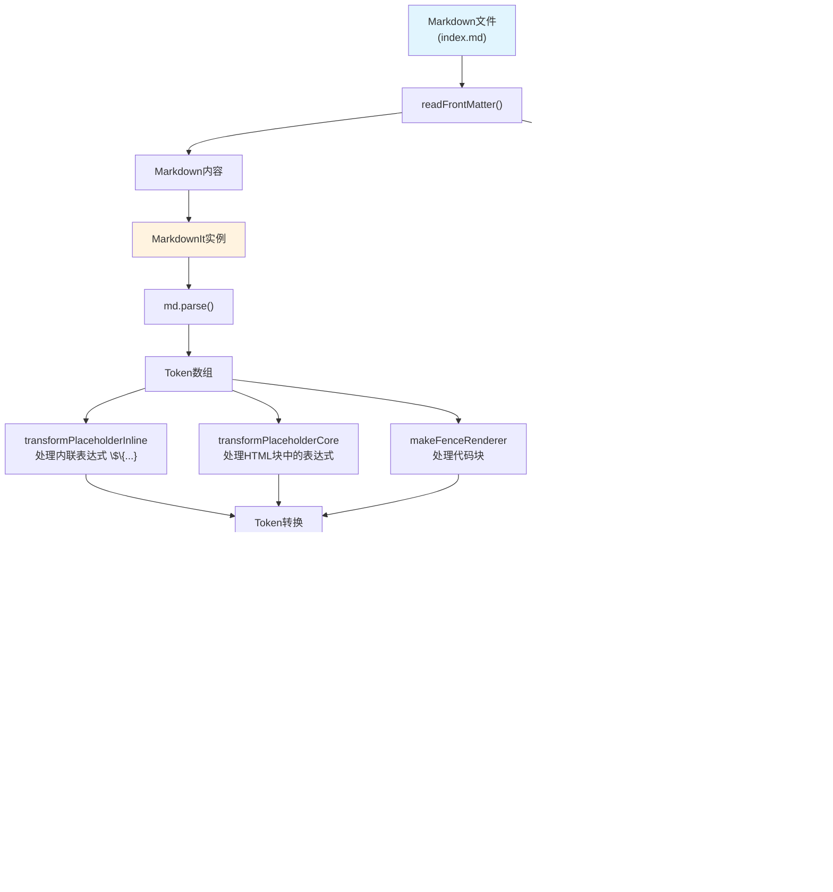

# Hotel reservations by market segment

## Excludes complementary reservations

```mermaid
graph TD;
    A["Markdown文件<br/>(index.md)"] --> B["readFrontMatter()"];
    B --> C["Front Matter数据"];
    B --> D["Markdown内容"];
    
    D --> E["MarkdownIt实例"];
    E --> F["md.parse()"];
    F --> G["Token数组"];
    
    G --> H["transformPlaceholderInline<br/>处理内联表达式 \$\{...}"];
    G --> I["transformPlaceholderCore<br/>处理HTML块中的表达式"];
    G --> J["makeFenceRenderer<br/>处理代码块"];
    
    H --> K["Token转换"];
    I --> K;
    J --> K;
    
    K --> L["md.renderer.render()"];
    L --> M["HTML Body"];
    
    C --> N["getHead()"];
    C --> O["getHeader()"];
    C --> P["getFooter()"];
    C --> Q["getStyle()"];
    
    M --> R["MarkdownPage对象"];
    N --> R;
    O --> R;
    P --> R;
    Q --> R;
    
    R --> S["renderPage()"];
    S --> T["完整HTML文档"];
    
    style A fill:#e1f5fe;
    style T fill:#c8e6c9;
    style E fill:#fff3e0;
    style R fill:#f3e5f5;
```

